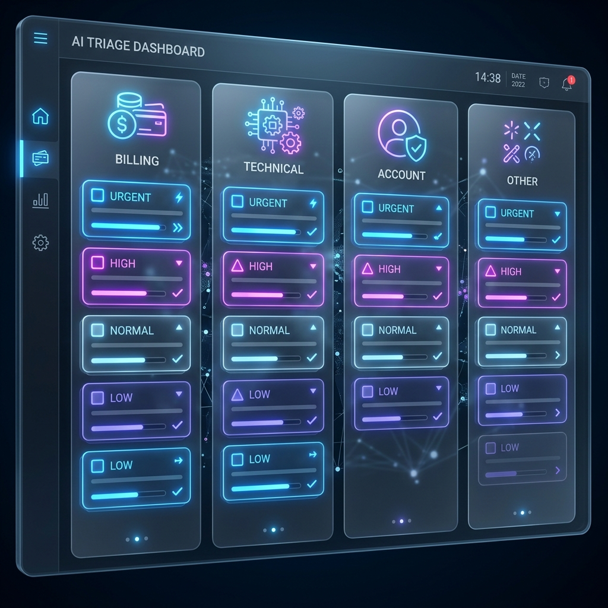

# 🎫 OpenEnv: Support Ticket Triage



## 🌟 Overview
**OpenEnv: Support Ticket Triage** is a high-fidelity environment designed for evaluating and training autonomous AI agents in real-world customer support workflows. Unlike simple games, this environment models a genuine business process: **Level 1 Support Triage**.

Agents are tasked with managing an incoming stream of tickets, navigating through varying levels of complexity to ensure customers receive timely and accurate responses.

---

## 🚀 Key Features
- **Real-World Fidelity**: Simulates actual customer support scenarios (billing issues, technical bugs, account recovery).
- **Grad graduated Difficulty**: Three distinct levels (Easy → Medium → Hard) to test agent reasoning limits.
- **Granular Reward Engine**: Scores agents based on categorization accuracy, priority logic, and action selection.
- **OpenEnv Compliant**: Fully implements the standard `step()`, `reset()`, and `state()` API.

---

## 🛠 Action & Observation Spaces

### **Action Space (`TicketAction`)**
The agent must provide a structured response for every ticket:
- **`category`**: `billing`, `technical`, `account`, or `other`.
- **`priority`**: `low`, `normal`, `high`, or `urgent`.
- **`action`**: `respond` (direct reply), `escalate` (send to specialized team), or `ignore` (spam/junk).

### **Observation Space (`TicketObservation`)**
At each step, the agent receives:
- **`next_ticket`**: A dictionary containing the `id`, `subject`, and `body` of the current ticket.
- **`remaining_tickets_count`**: Real-time feedback on queue progress.
- **`message`**: System status updates.

---

## 🎯 Task Breakdown

| Task | Tickets | Focus | Reward Signal |
| :--- | :---: | :--- | :--- |
| **Easy** | 3 | Categorization | Pure categorization accuracy (1.0/ticket). |
| **Medium** | 5 | Contextual Priority | Categorization (0.5) + Logic-based Priority (0.5). |
| **Hard** | 6 | End-to-End Resolution | Cat (0.33) + Priority (0.33) + Action (0.33). |

---

## 🔧 Setup & Usage

### **Containerized Execution**
The environment is fully containerized for seamless deployment on Hugging Face Spaces.

```bash
# Build the environment
docker build -t openenv-support-triage .

# Run the environment
docker run -p 7860:7860 openenv-support-triage
```

### **Run Baseline Evaluation**
Execute the baseline inference script to see the environment in action:
```bash
export API_BASE_URL="your_endpoint"
export MODEL_NAME="your_model"
export HF_TOKEN="your_token"

python inference.py
```

---

## 📊 Baseline Scores
*Initial benchmarks using GPT-4o-mini:*
- **Easy**: 1.00
- **Medium**: 0.95
- **Hard**: 0.88

---
*Created for the Meta OpenEnv Hackathon Round 1.*
